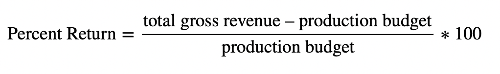
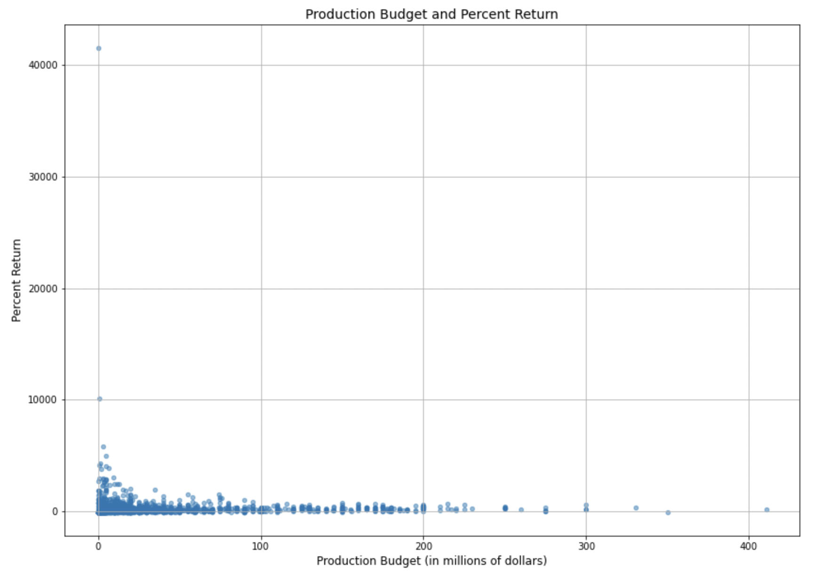
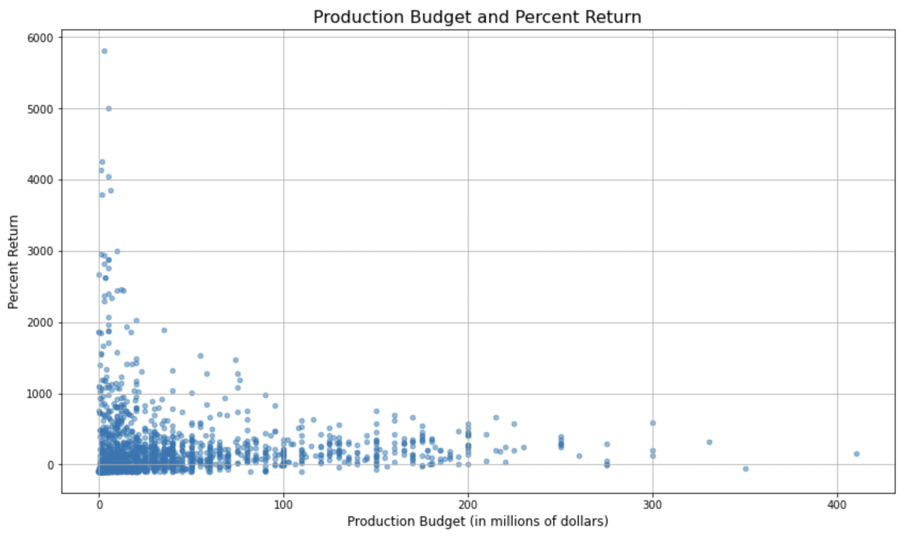
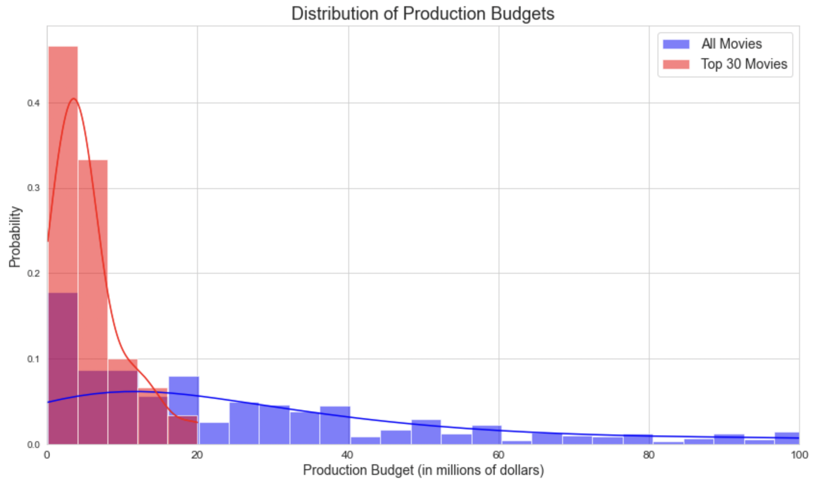
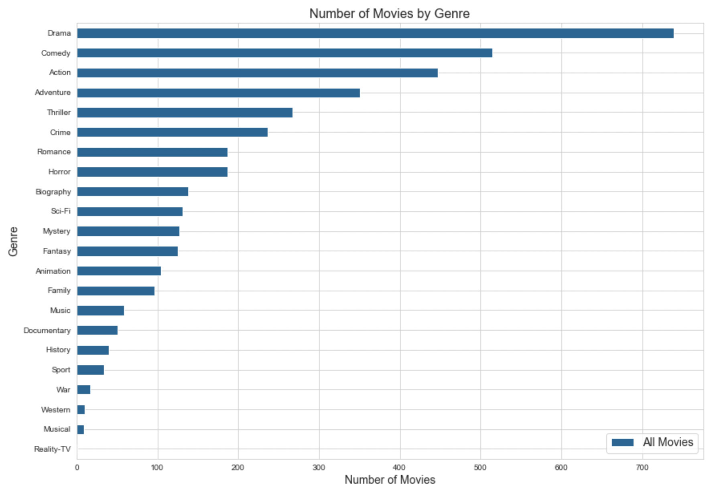
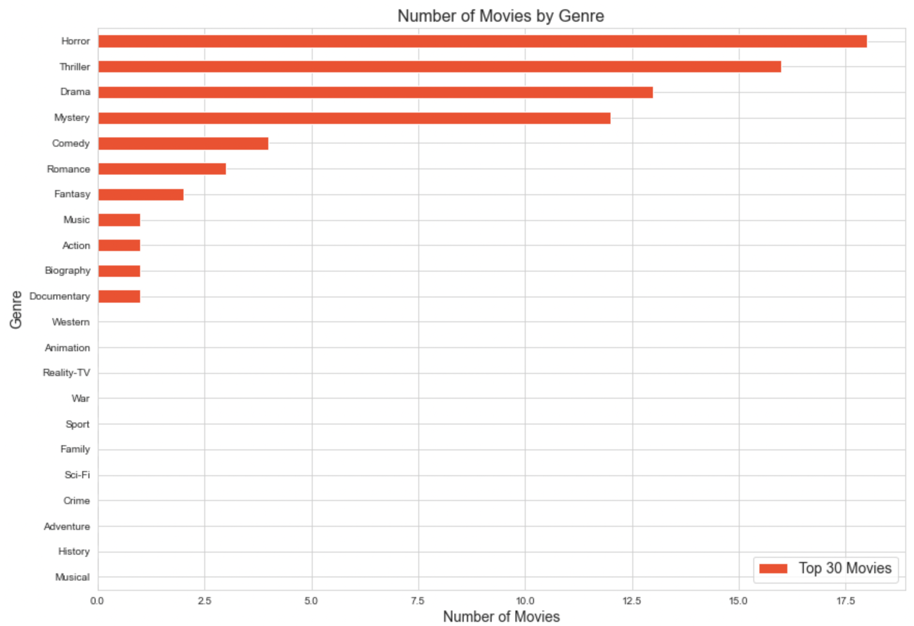
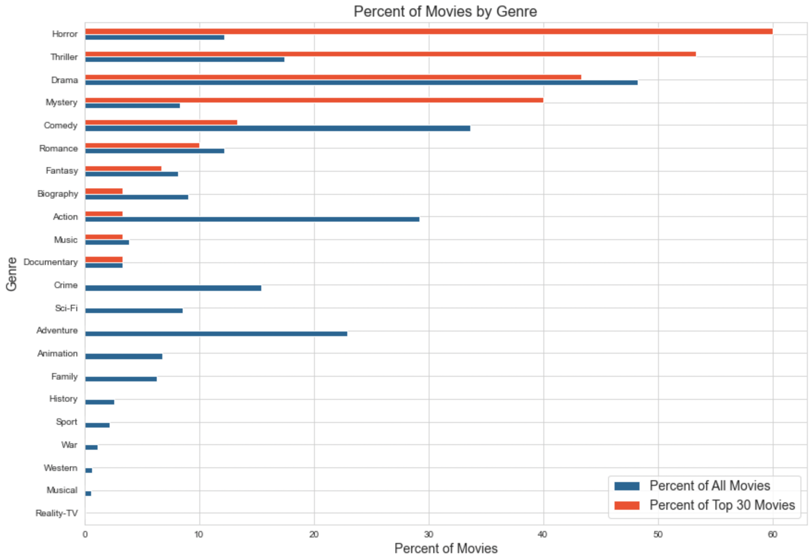
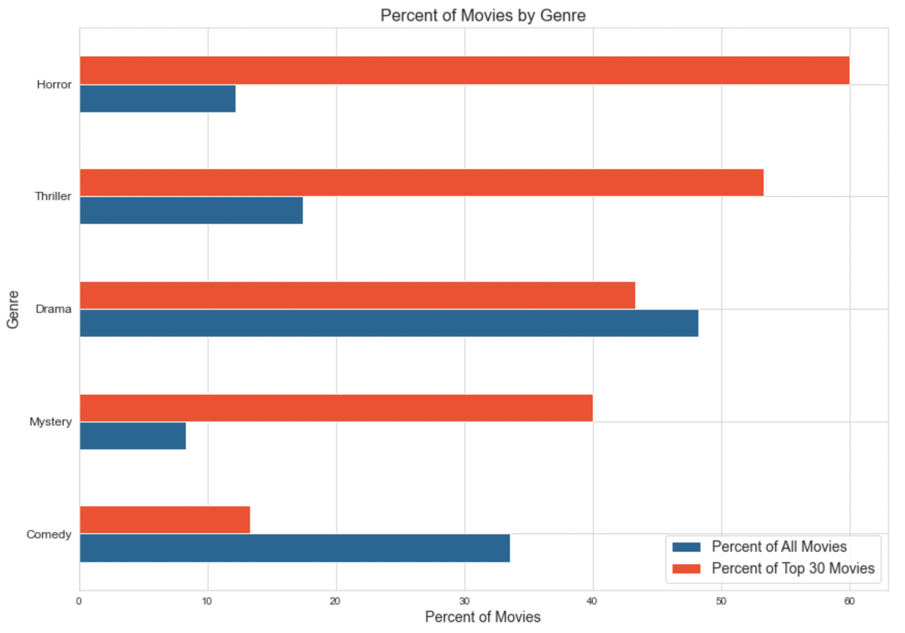
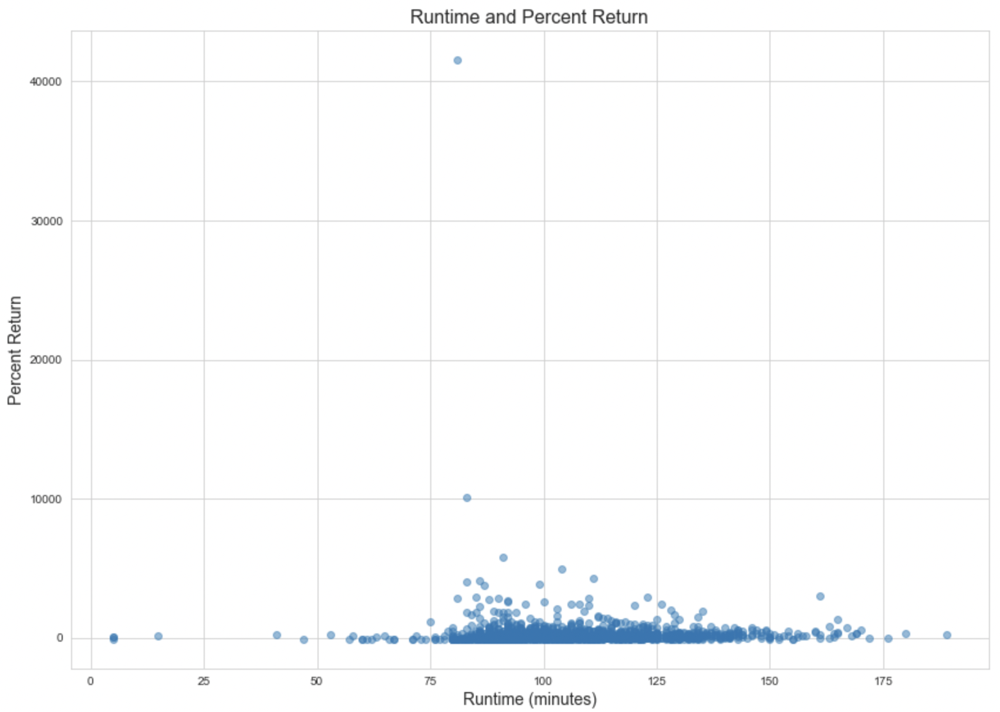
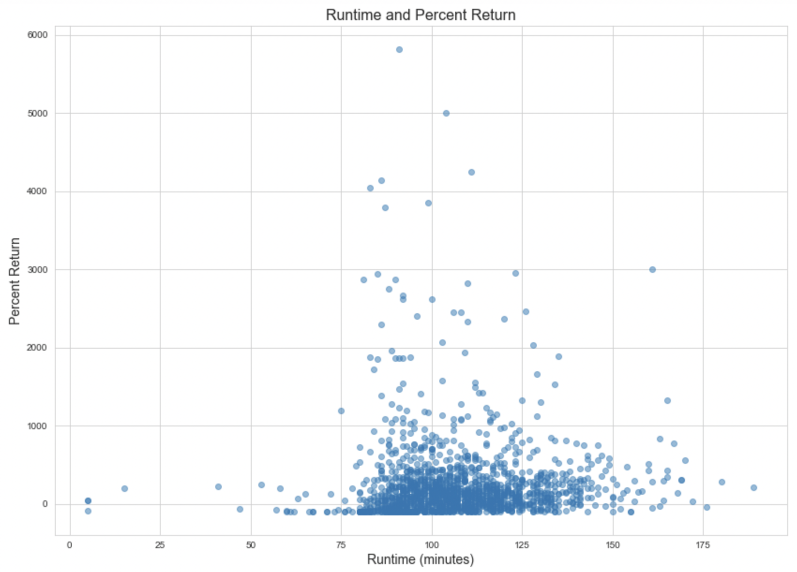

# Phase 2 Project


# Overview

In this analysis, a highly profitable subset of movies is defined using percent return. Then, this subset is analyzed by feature to determine how these movies behave in comparison to all movies. 

The three features considered are:
* Production budget
* Genre
* Runtime


# Business Understanding

This analysis was conducted for a company that is interested in creating original video content. However, the company lacks insight as to what types of films perform best at the box office. This analysis seeks to understand patterns and trends in movie performance in order to recommend what types of films the company should produce to maximize profit.

For the purpose of this analysis, movie performance will be evaluated using **percent return on investment**. This feature will provide more insight than evaluating **total gross revenue** alone since it takes into consideration the size of the initial investment (in this case, the budget to produce the film).

Therefore, this analysis will consider the most successful movies to be those earning the highest percent returns.


# Data Understanding

Two datasets were used for this analysis.

The first dataset is from [The Numbers](https://www.the-numbers.com). This dataset contains information about nearly 6,000 film budgets and revenues from 1915-2020, with most entries falling between the years 2000-2012. This dataset is stored in this repository as a compressed CSV file.

The second dataset is from [IMDB](https://www.imdb.com). This dataset is a SQLite database with information about over 146,000 movies, including information about each movie's length, when it was released, and its genre. This database also contains information about actors/actresses, directors, and writers, as well as which films they are associated with.

While there are significantly more entries in the IMDB dataset, this information will not be useful to the company without additional information about the profitability of the movie. Therefore, only entries in IMBD that have a corresponding entry in The Numbers dataset will be considered.

Additionally, because the company is interested in movies that currently perform well, only movies that were released in the year 2000 or later will be considered for analysis.


# Data Analysis


## Methods

The process by which I conducted this analysis is outlined below. For a more complete understanding of the methods used, refer to the [Jupyter Notebook](./notebook.ipynb)

* Calculated percent return for all movies using the formula below



* Created a subset of the 30 movies with the highest percent returns

* Compared the subset to the entire dataset across three features: production budget, genre, and runtime (including visual analysis and statistical analysis)


## Results

### Production Budget

First, I analyzed the relationship between production budget and percent return. An initial scatterplot of these two variables reveals that the films with some of the highest percent returns have relatively low budgets. 


However, this visualization is somewhat difficult to interpret, since the two extreme values (the films with returns of approximately 40,000% and 10,000%) significantly affect the y-axis.

In the visualization below, I have dropped these two extreme values in order to better visualize the relationship for the rest of the data. _**These values will not be dropped from the dataset used for analysis - they are simply being temporariily ignored in order to improve the visualization.**_


Now, we can more clearly see the relationship between production budget and percent return. This relationship is still clearly nonlinear, but it is more obvious that the films with the highest percent returns have budgets that are less than \$100 million.

On average, the top 30 movies have a production budget of \$5,360,000, which is much lower than the average budget for all movies (approximately \$44,000,000). 

In order to determine whether this difference is statistically significant, I conducted a t-test at with a standard alpha level of 0.05. The results led me to **reject the null hypothesis** at the standard alpha level of 0.05: it is extremely unlikely that highly profitable movies have the same or higher production budgets than all movies. Highly profitable movies have lower production budgets than all movies.

The graph below illustrates the distribution of all films and highly profitable films by budget.


In order to recommend a specific budget for the company, I computed a 95% confidence interval for the mean of the subset. This interval led me to my first recommendation:
**I recommend that the company produce films with budget between \$3.6 million and \$7.1 million.** We can be 95\% confident that the true average production budget for highly successful films falls within this range.


### Genre

Next, I analyzed the movies by genre to determine if the highly profitable movies are distributed the same way. Below, you will see graphs that represent the genre distribution of all movies, the top 30 movies, and all movies and the top 30 movies side by side (using percentages rather than counts).





While there are some differences that are clearly apparent from these graphs, they are somewhat difficult to interpret. Additionally, they contain some information that is less relevant to this analysis, as the company is most interested in the top-performing movies. 

Therefore, I will create a second double bar chart that only includes the 5 most common genres for the highly profitable subset. 



The majority of movies in the highly profitable subset are classified as "Horror" (60%) and/or "Thriller" (53%). However, much smaller proportions of the set of all movies fit these classifications (12% and 17%, respectively).

Similarly, the proportion of movies classified as "Mystery" is much larger for the highly profitable movies (40%) than for all movies (8%).

In order to test whether these differences are statistically significant, I performed a chi-squared contingency test with the standard alpha value of 0.05. The results led me to **reject the null hypothesis** at the standard alpha level of 0.05: it is extremely unlikely that these two groups behave the same way with regard to distribution across genre. 

**Therefore, I recommend taht the company mimic the genre distribution of the highly profitable films and produce films classified as "Horror", "Thriller", "Drama", and/or "Mystery".** Films in these genre categories make up the vast majority of highly profitable films.


### Runtime

Finally, I explore the relationship between runtime and percent return. First, I visualized the relationship with a scatterplot.


However, this visualization is somewhat difficult to interpret, since the two extreme values (the films with returns of approximately 40,000% and 10,000%) significantly affect the y-axis.

In the visualization below, I have dropped these two extreme values in order to better visualize the relationship for the rest of the data. _**These values will not be dropped from the dataset used for analysis - they are simply being temporariily ignored in order to improve the visualization.**_


Although there is not a linear relationship between these two variables, it does appear that many of the most profitable movies are clustered between approximately 80-130 minutes.

The descriptive statistics of the subset and entire dataset reveal that highly profitable movies have a slightly shorter runtime, on average, compared to all movies (101 minutes vs. 107 minutes). In order to determine whether this difference was statistically significant, I conducted a t-test with a standard alpha level of 0.05.

This t-test led me to **reject the null hypothesis** at the standard alpha level of 0.05: it is  unlikely that highly profitable movies have the same or higher runtimes compared to all movies. Highly profitable movies appear to have shorter runtimes than all movies, on average.

In order to recommend a specific runtime for the company's movies, I computed a 99% confidence interval for the mean of the subset. This led me to my third and final recommendation: 
**I recommend that the company produce films between 92 and 110 minutes in length.** We can be 99% confident that the true average length for highly profitable films falls within this interval.


# Conclusion

While there are many ways to determine what makes a movie "successful" (critical acclaim, number of viewers, public opinion, etc.), a company's primary measure of succss will be profitability. Therefore, in conducting this analysis, I calculated percent return and used this feature in order to define a subset of the most successful movies. Then, I analyzed this subset to determine how highly profitable movies behave compared to all movies we have data for.

This analysis led me to three key findings, outlined below. It is important to once again iterate that we do not have evidence that any of these features _cause_ movies to generate higher percent returns. However, we do have evidence that these features are correlated with higher percent returns.


* **On average, highly successful movies have lower production budgets than all movies.**  I recommend that the company produce films with budget between \$3.6 million and \$7.1 million. We can be 95% confident that the true average production budget for highly successful films falls within this range, despite it being significantly smaller than the average production budget for all films (approximately \$44 million).


* **The majority of highly successful movies are classified as Horror, Thriller, Drama, and/or Mystery movies.** The difference in breakdown of movies by genre for the subset compared to all movies is statistically significant: that is, it is unlikely that there are more movies in these categories due to random chance. Therefore, I recommend that the company focus their production efforts on movies in these categories.


* **On average, highly successful movies are slightly shorter than all movies.** While this difference is slight (101 minutes compared to 107 minutes), it is statistically significant at the standard alpha level of 0.05. Therefore, I recommend that the company produce films with runtimes between 92 and 110 minutes in length. We can be 95\% confident that the true average runtime for highly successful films falls within this range.


## Additional Resources

The full analysis can be viewed in the [Jupyter Notebook](./notebook.ipynb). This repository also contains a [presentation](./presentation.pdf) of the findings.

For additional information, contact Caroline Surratt via [email](mailto:carolinecsurratt@gmail.com).

## Repository Structure

```
├── data
├── images
├── notebook.ipynb
├── presentation.pdf
└── README.md
```
 
